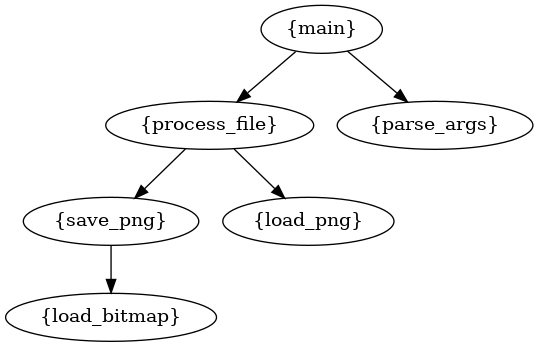

# callswhat
a tool to generate call graphs given an input C source directory

python callswhat.py -d {input_dir} -o {output_file}

 dependencies:
 
* pygraphviz 	(pip install)
* graphviz 	  (package)
*	llvm 		    (package)
*	clang 		  (package)

